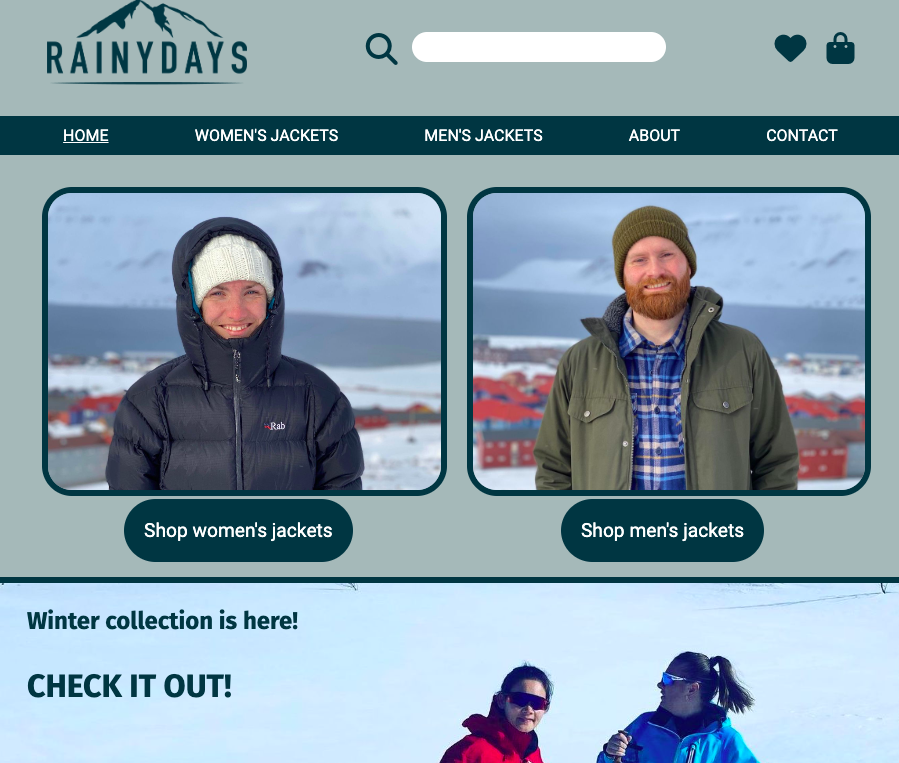

# Cross course project – RainyDays



RainyDays is an online store selling rain jackets to men and women.

## Description

This project is part of a cross course delivery for first year Front End Development students at Noroff, covering design, HTML and CSS, JavaScript, interaction design and content management systems.

The RainyDays store has a range of men's and women's rain jackets, and the main target group are men and women aged 30-50 years old who are active and like the outdoors all year around.

The website is responsive across devices and it is fetching products from a WordPress REST API.

### Requrements for pages

- Home
- List of jackets
- A jacket specific page, showing product details such as description, price and an add to cart button
- A checkout page
- A checkout completed page
- About
- Contact

## Built with

- HTML
- CSS
- JavaScript
- WordPress

## Getting started

### Installing

It is easy for you to get this project started:

1. Clone the repository:

```bash
git clone git@github.com:Noroff-FEU-Assignments/cross-course-project-VReinhaug
```

2. Install the dependencies:

```
npm install
```

### Running

To run the app, run the following command:

```
npm run start
```

##Contact
For any feedback or questions, please contact me [on LinkedIn](https://www.linkedin.com/in/veronika-reinhaug/).
